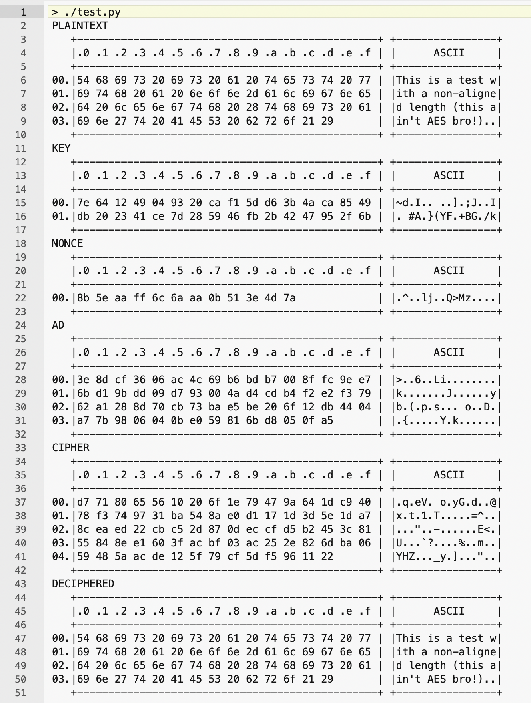

# Chacha20_Dylib

This small dylib is adapted from [portable8439](https://github.com/DavyLandman/portable8439) to provide easy-to-use Chacha20 encryption from frameworks that don't have it, like Python or Xojo.

## Usage

There are 2 main entry points, `encrypt` and `decrypt`. In Python you need to pass pointers to char arrays:

```python
plain = b"This is a test with a non-aligned length (this ain't AES bro!)"
TEXT_SIZE = len(plain)
plainB = cast(plain, POINTER(c_char))
buffer = bytes(TEXT_SIZE + RFC_8439_TAG_SIZE)
bufferB = cast(buffer, POINTER(c_char))
buffer2 = bytes(TEXT_SIZE)
buffer2B = cast(buffer2, POINTER(c_char))

ad = random.randbytes(TEXT_SIZE)
adB = cast(ad, POINTER(c_char))
key = random.randbytes(RFC_8439_KEY_SIZE)
keyB = cast(key, POINTER(c_char))
nonce = random.randbytes(RFC_8439_NONCE_SIZE)
nonceB = cast(nonce, POINTER(c_char))

cipher_size = chacha.encrypt(plainB, TEXT_SIZE, adB, TEXT_SIZE, keyB, nonceB, bufferB)

result = chacha.decrypt(buffer2B, key, nonce, ad, TEXT_SIZE, bufferB, cipher_size)
```

